# RestOh! User Manual

## Table of Contents

1. [Introduction](#1-introduction)
2. [Getting Started](#2-getting-started)
3. [Navigating the Application](#3-navigating-the-application)
4. [Ordering Food](#4-ordering-food)
5. [Booking a Table](#5-booking-a-table)
6. [Managing Your Account](#6-managing-your-account)
7. [Leaving Reviews](#7-leaving-reviews)
8. [Administrator Dashboard](#8-administrator-dashboard)
9. [FAQ](#9-faq)
10. [Contact & Support](#10-contact--support)

---

## 1. Introduction

### Welcome to RestOh!

RestOh! is a comprehensive restaurant management web application that allows you to:
- **Browse the menu** with detailed descriptions, prices, and allergen information
- **Order food** for delivery or pickup
- **Book a table** using an interactive restaurant floor plan
- **Leave reviews** on dishes and the restaurant
- **Manage your account** and track your orders

### Target Audience

This application is designed for:
- **Customers** who want to easily order or make reservations
- **Administrators** who manage orders, reservations, and the menu

### Key Features

| Feature | Description |
|---------|-------------|
| Interactive Menu | Browse all dishes with filters by category and cuisine |
| Smart Cart | Add items and place orders easily |
| Reservations | Choose your table on an interactive floor plan |
| Reviews | Share your experience on dishes and the restaurant |
| Order Tracking | Track your order status in real-time |
| Admin Dashboard | Manage the entire restaurant from one place |

---

## 2. Getting Started

### 2.1 Creating an Account

To enjoy all RestOh! features, you need to create an account.

1. Click **"Create an account"** from the login page
2. Fill in the form:
   - **Full name**: Your first and last name
   - **Email address**: A valid email address
   - **Password**: Minimum 6 characters
   - **Confirmation**: Re-enter your password
3. Accept the terms of use
4. Click **"Create my account"**

> **Note**: A verification email will be sent to you. Check your inbox.

### 2.2 Logging In

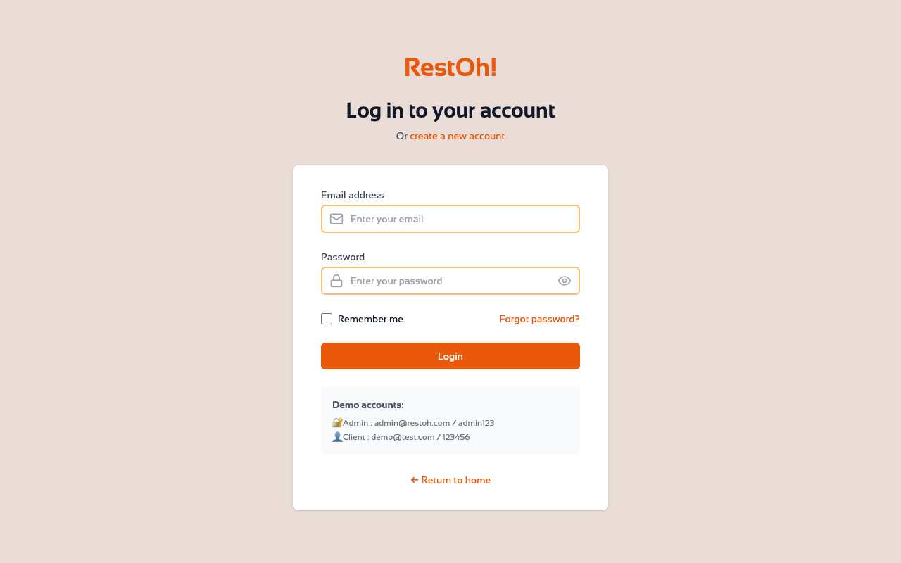

1. Go to the login page
2. Enter your **email address** and **password**
3. Check **"Remember me"** to stay logged in longer (7 days instead of 24h)
4. Click **"Login"**

**Demo accounts available:**
- Admin: `admin@restoh.com` / `admin123`
- Customer: `demo@test.com` / `123456`

### 2.3 Password Recovery

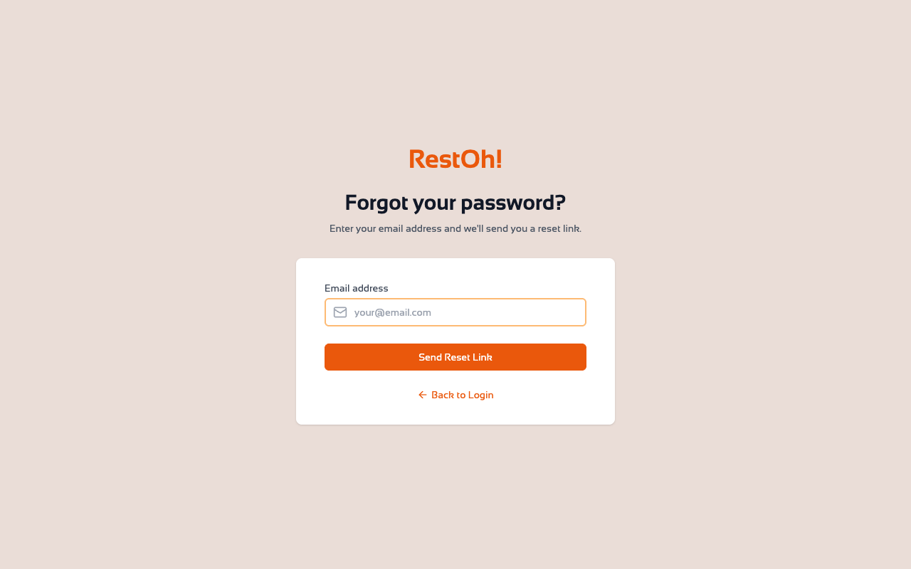

If you've forgotten your password:

1. Click **"Forgot password?"** on the login page
2. Enter your email address
3. Click **"Send Reset Link"**
4. Check your email and click on the link received
5. Choose a new password

---

## 3. Navigating the Application

### 3.1 Home Page

The home page introduces RestOh! and provides quick access to main features.

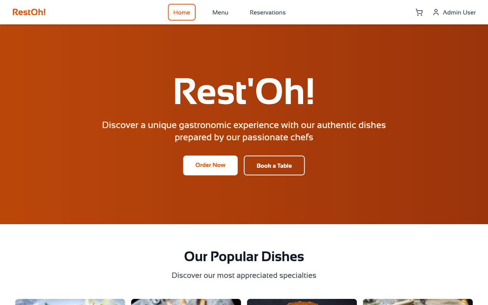

**Main elements:**
- **"Order Now" button**: Direct access to the menu
- **"Book a Table" button**: Access to the reservation page

### 3.2 Popular Dishes

A carousel showcases the most popular dishes among our customers. Each card displays:
- The dish image
- Name and category
- Price
- A **"+ Cart"** button to add directly

### 3.3 Why Choose RestOh!

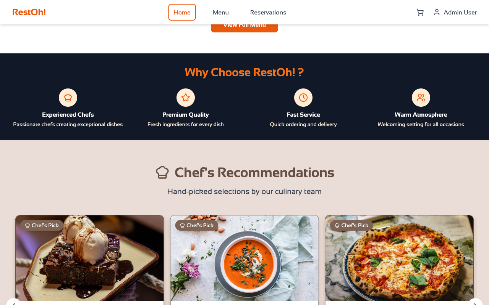

Discover our four key strengths:
- **Experienced Chefs**: Passionate professionals
- **Premium Quality**: Fresh, selected ingredients
- **Fast Service**: Efficient ordering and delivery
- **Warm Atmosphere**: A welcoming setting

### 3.4 Chef's Recommendations

Dishes selected by our chef are identified with a **"Chef's Pick"** badge and displayed in a dedicated section.

### 3.5 Customer Reviews

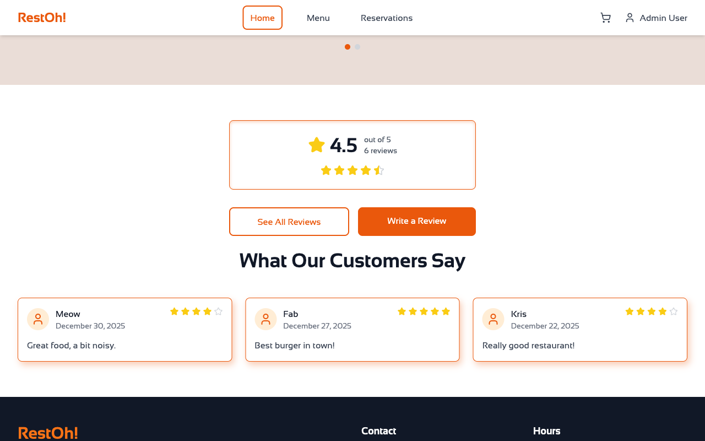

View the latest reviews from our customers with:
- The restaurant's average rating
- Recent comments
- Buttons to see all reviews or write one

### 3.6 Navigation Bar

The navigation bar at the top of the page provides access to:
- **Home**: Main page
- **Menu**: Browse all dishes
- **Reservations**: Book a table
- **Cart icon**: View your cart
- **User menu**: Access your account

---

## 4. Ordering Food

### 4.1 Browsing the Menu

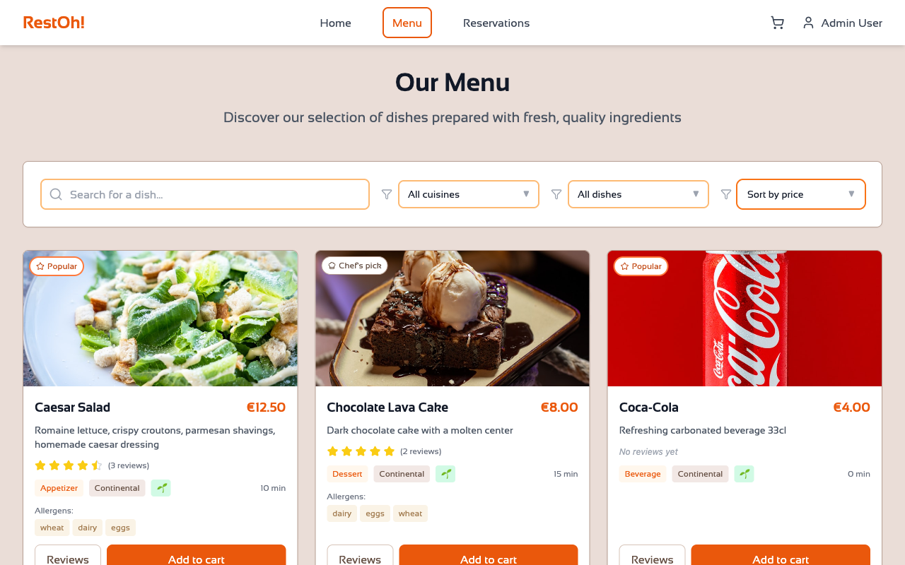

The Menu page displays all available dishes as detailed cards.

**Each card shows:**
- Dish photo
- Name and price
- Description
- Average rating and number of reviews
- Category (appetizer, main, dessert, beverage)
- Cuisine type
- Preparation time
- Allergens (if applicable)
- Special badges (Popular, Chef's Pick)

### 4.2 Filtering and Searching

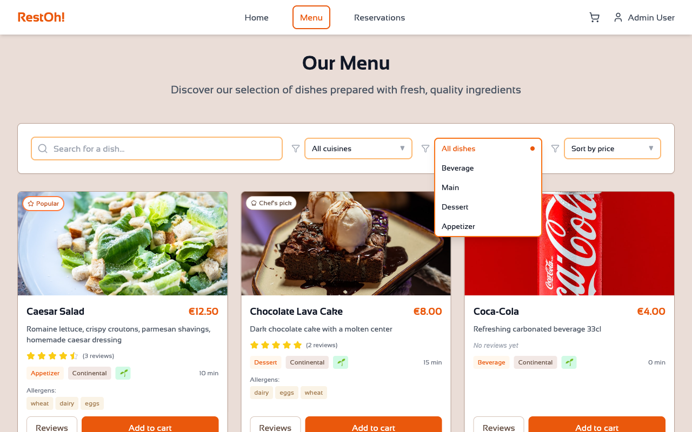

Use filters to quickly find what you're looking for:

| Filter | Options |
|--------|---------|
| **Search** | Type a dish name |
| **Cuisine** | All, Continental, etc. |
| **Category** | All, Appetizers, Mains, Desserts, Beverages |
| **Sort** | By price (ascending/descending) |

### 4.3 Understanding Badges

Dishes may have special badges:

| Badge | Meaning |
|-------|---------|
| **Popular** | Highly rated by customers |
| **Chef's Pick** | Chef's recommendation |
| 🌱 | Vegetarian dish |

### 4.4 Viewing Dish Reviews

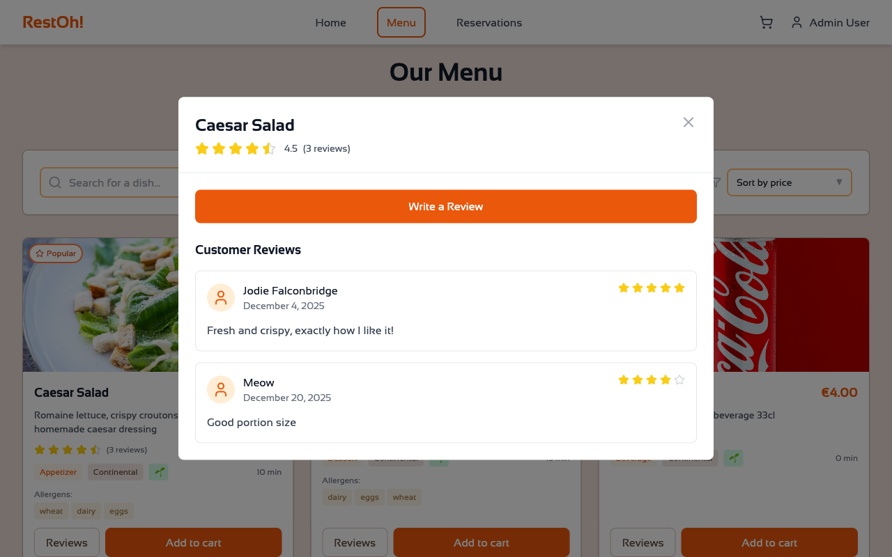

Click the **"Reviews"** button to see all reviews for a dish:
- Average rating
- List of comments with date and author
- Option to add your own review

### 4.5 Adding to Cart

To add a dish to your cart:
1. Click the **"Add to cart"** or **"+ Cart"** button
2. The cart counter increases in the navigation bar
3. A notification confirms the addition

### 4.6 Managing the Cart

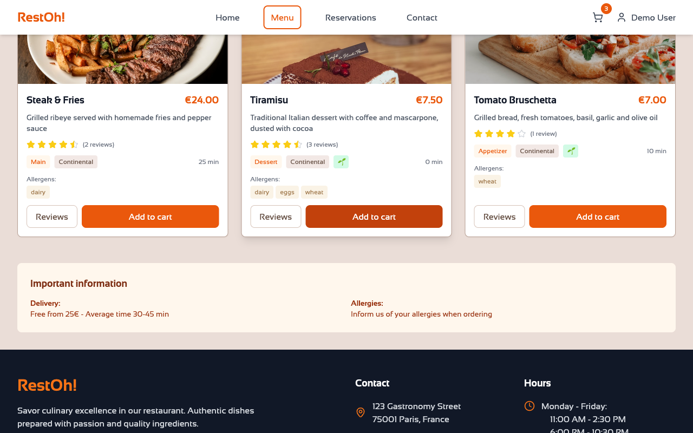

Open the cart by clicking the cart icon. You can:
- **Modify quantities** with the + and - buttons
- **Remove an item** by clicking the trash icon
- **View the total** updated in real-time
- **Proceed to checkout** by clicking "Checkout"

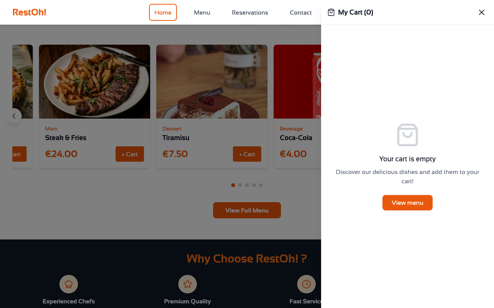

If your cart is empty, a message invites you to explore the menu.

### 4.7 Placing an Order

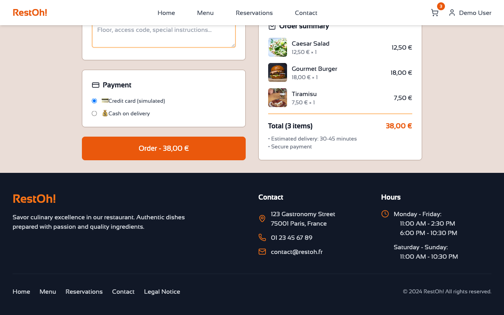

The ordering process consists of several steps:

**1. Delivery Information:**
- Full name
- Phone number
- Delivery address (if delivery)

**2. Delivery Method:**

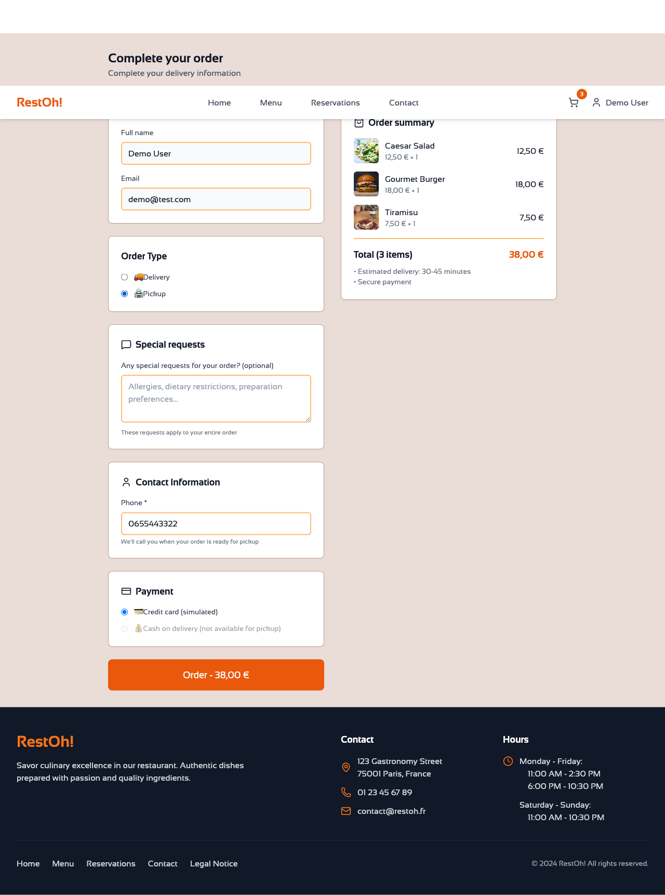

- **Delivery**: The driver brings your order to the specified address
- **Pickup**: You collect your order at the restaurant

**3. Payment Method:**
- **Credit card**: Immediate payment (secure)
- **Cash**: Payment on delivery/pickup

**4. Confirmation:**
- Review your order summary
- Click **"Confirm Order"**

> **Important:**
> - Free delivery from €25
> - Average delivery time: 30-45 minutes

### 4.8 Tracking Your Orders

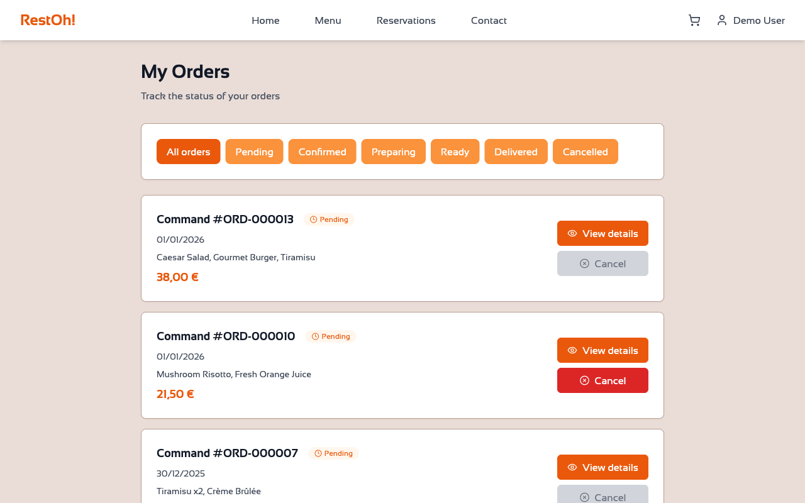

Access **"My Orders"** from your profile to see:
- History of all your orders
- Status of each order

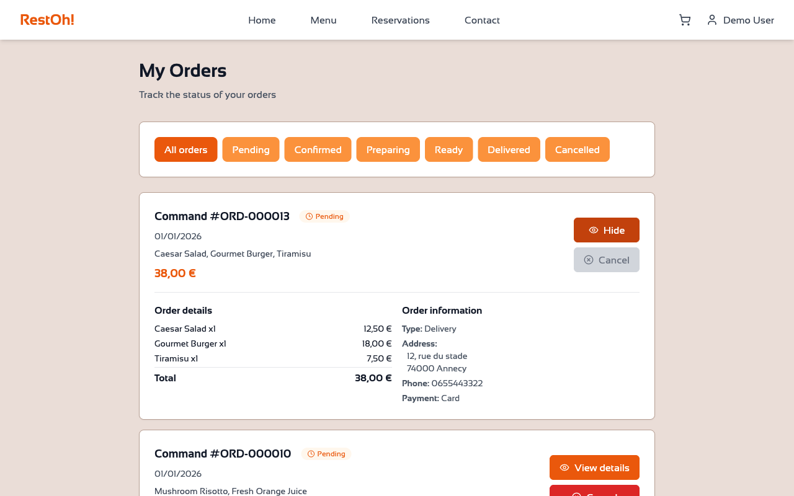

Click on an order to see details:
- List of ordered items
- Prices and quantities
- Delivery address
- Payment method
- Current status

**Possible statuses:**

| Status | Description |
|--------|-------------|
| **Pending** | Order received, awaiting confirmation |
| **Confirmed** | Order accepted by the restaurant |
| **Preparing** | Your dishes are being prepared |
| **Ready** | Order ready for delivery/pickup |
| **Delivered** | Order completed |
| **Cancelled** | Order cancelled |

---

## 5. Booking a Table

### 5.1 Reservation Form

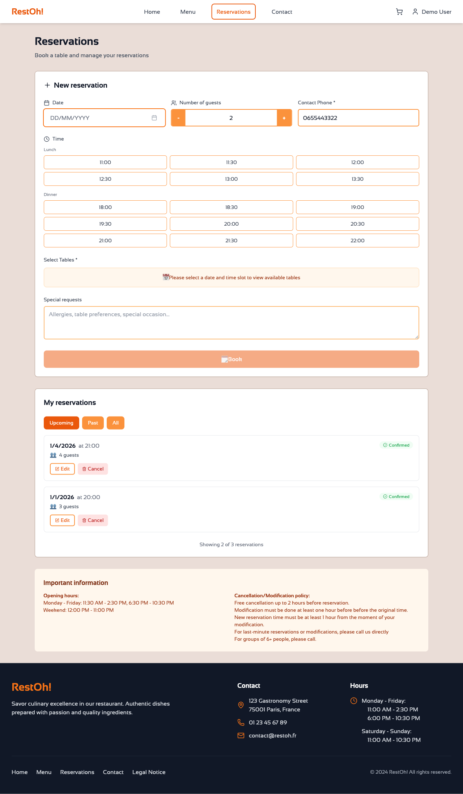

To book a table:

1. Go to **"Reservations"** from the menu
2. Fill in the form:
   - **Number of guests**: From 1 to 10 people
   - **Date**: Select from the calendar
   - **Time**: Choose an available time slot

### 5.2 Choosing the Date

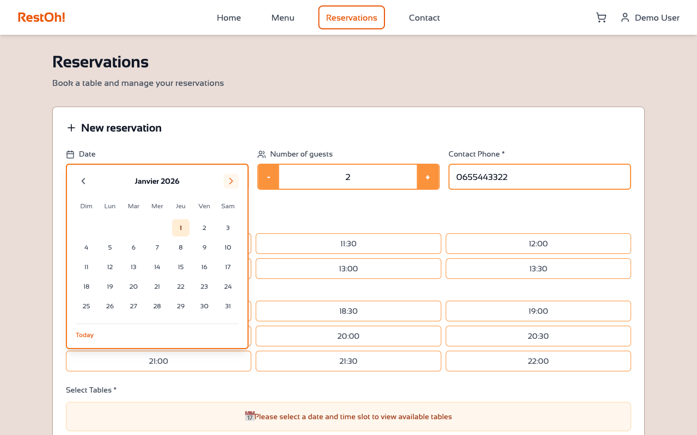

The calendar displays:
- Available days (clickable)
- Past days (grayed out)
- Today's date (highlighted)

### 5.3 Selecting a Table

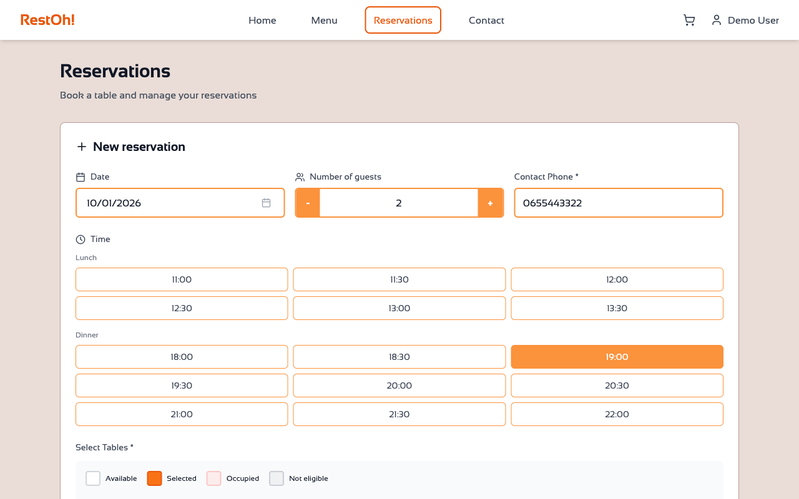

The interactive restaurant floor plan allows you to choose your table:

**Color code:**
| Color | Meaning |
|-------|---------|
| **Green** | Table available for your group |
| **Red** | Table already reserved |
| **Gray** | Table too small for your group |

**Table capacities:**
- Tables for 2 people
- Tables for 4 people
- Tables for 6 people
- Large tables (8+ people)

> **Rule**: A table can accommodate up to its maximum capacity + 1 person.

### 5.4 Confirming the Reservation

After selecting your table:
1. Review the summary
2. Add special notes if needed (birthday, allergies...)
3. Click **"Confirm Reservation"**

### 5.5 Managing Your Reservations

From **"My Reservations"** in your profile:

**Modifying a reservation:**
- Possible up to **1 hour before** the scheduled time
- Change the date, time, or number of guests

**Cancelling a reservation:**
- Free up to **2 hours before** the scheduled time
- Beyond that, contact the restaurant

### 5.6 Important Rules

- **Minimum notice**: Reservation possible at least 1 hour in advance
- **Groups of 6+ people**: We recommend calling the restaurant
- **Arrival**: Please arrive at the scheduled time

---

## 6. Managing Your Account

### 6.1 Accessing Your Profile

Click on your name in the navigation bar, then on **"My Profile"**.

### 6.2 Personal Information

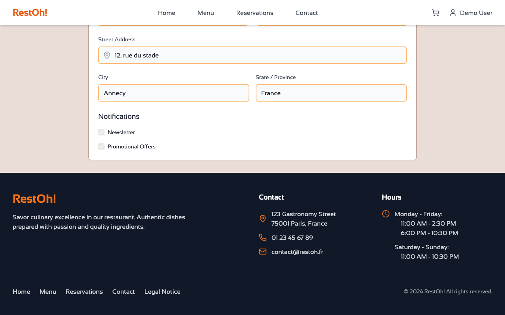

In the **"Personal Information"** tab:
- View your name and email
- Modify your information by clicking **"Edit"**

### 6.3 Security

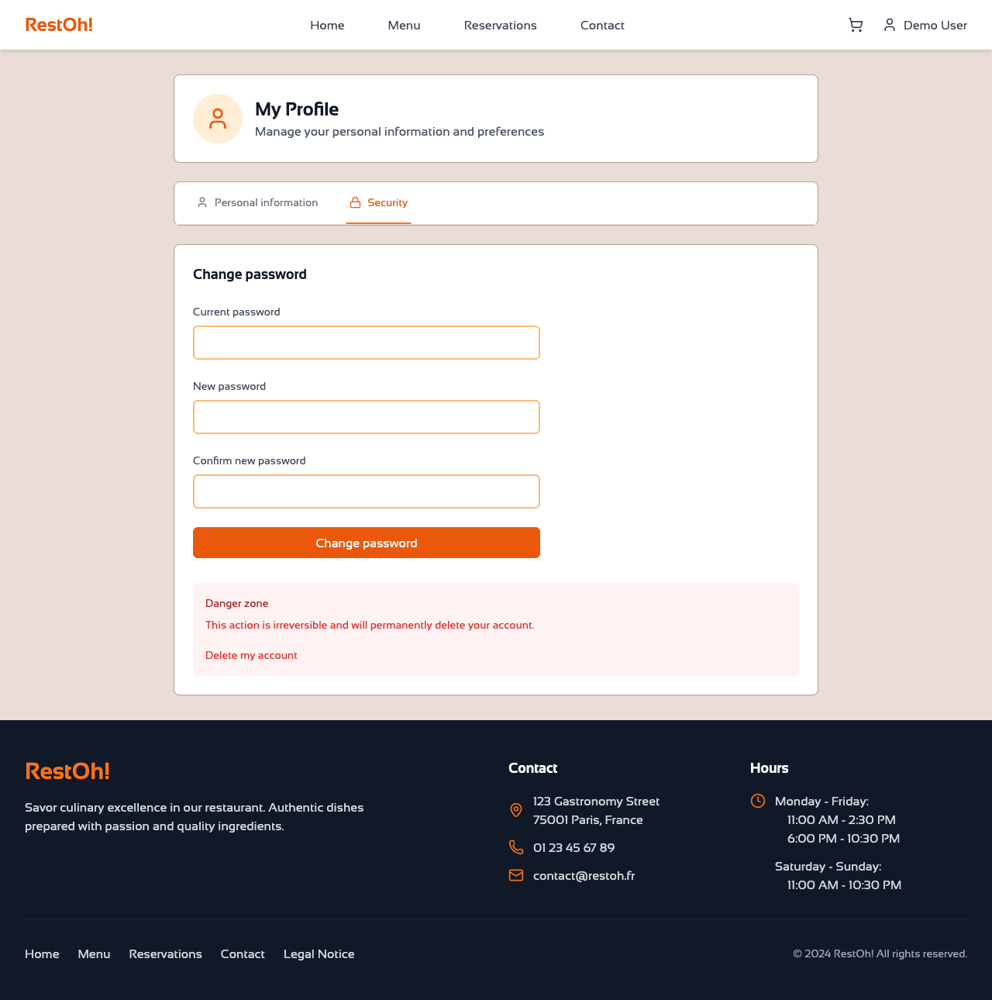

In the **"Security"** tab:

**Changing your password:**
1. Enter your current password
2. Enter the new password (min. 6 characters)
3. Confirm the new password
4. Click **"Change Password"**

**Deleting your account:**
- Click **"Delete My Account"**
- Confirm by typing "DELETE"
- Enter your password

> **Warning:**
> - Deletion is **irreversible**
> - Not possible if you have an unpaid pending order
> - Active reservations will be automatically cancelled

---

## 7. Leaving Reviews

### 7.1 Dish Reviews

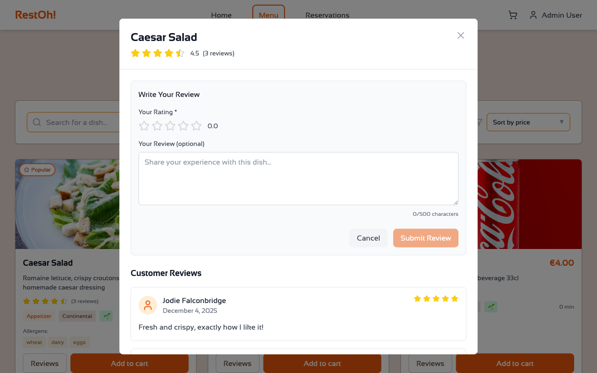

To rate a dish:
1. Go to the Menu page
2. Click **"Reviews"** on the desired dish
3. Click **"Write a Review"**
4. Select a rating (1 to 5 stars)
5. Add a comment (optional)
6. Click **"Submit Review"**

### 7.2 Restaurant Reviews

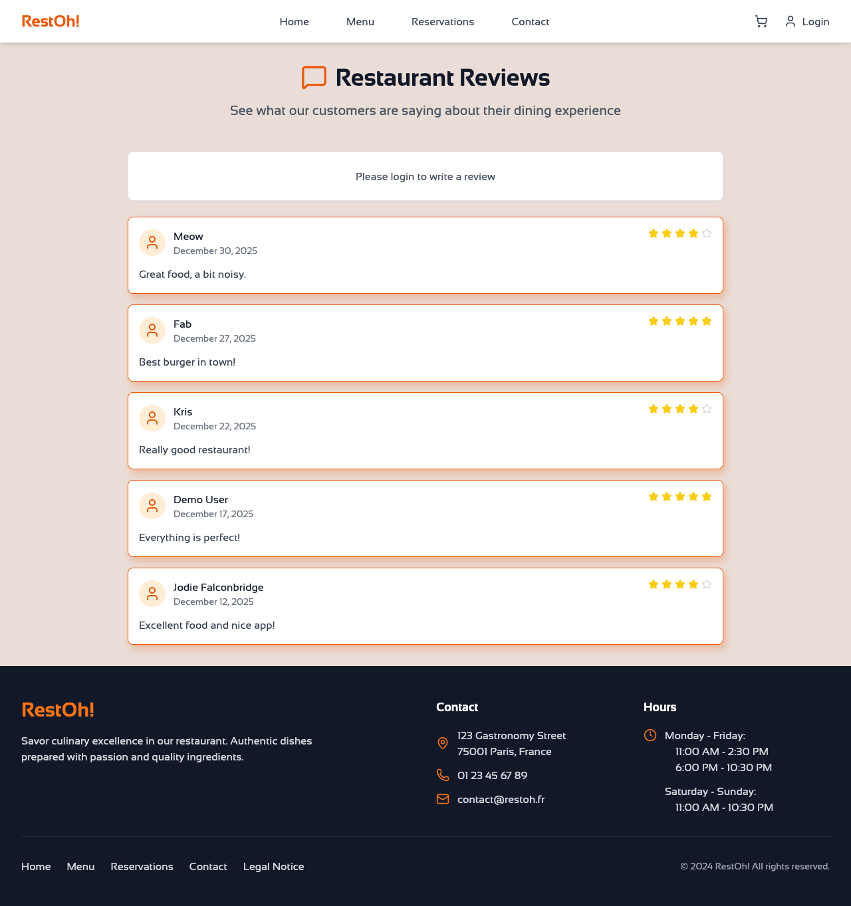

To give your opinion on the restaurant:
1. Go to the **"Reviews"** page from the home page
2. Click **"Write a Review"**
3. Rate your overall experience
4. Describe your visit
5. Publish your review

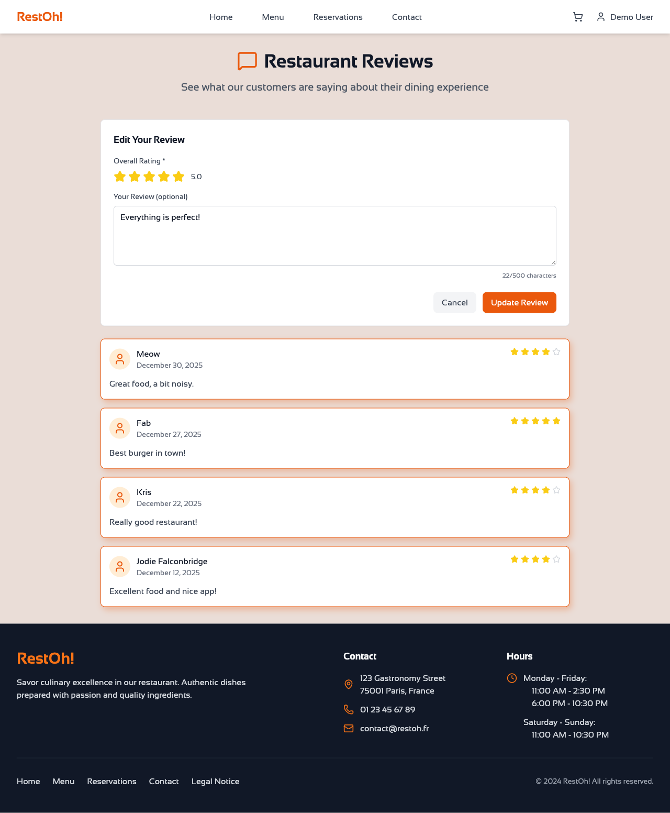

**Editing or deleting your review:**
- Find your review on the page
- Click **"Edit"** to modify it
- Or **"Delete"** to remove it

---

## 8. Administrator Dashboard

This section is reserved for restaurant administrators.

### 8.1 Accessing the Dashboard

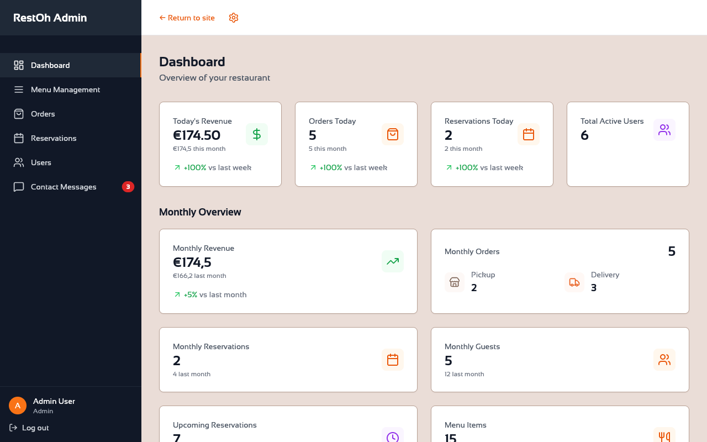

Log in with an administrator account and click **"Admin Panel"** in the user menu.

The dashboard displays:
- **Today's statistics**: Revenue, orders, reservations
- **Comparisons**: With the previous month and the same day last week
- **Recent activity**: Latest orders and reservations

### 8.2 Order Management

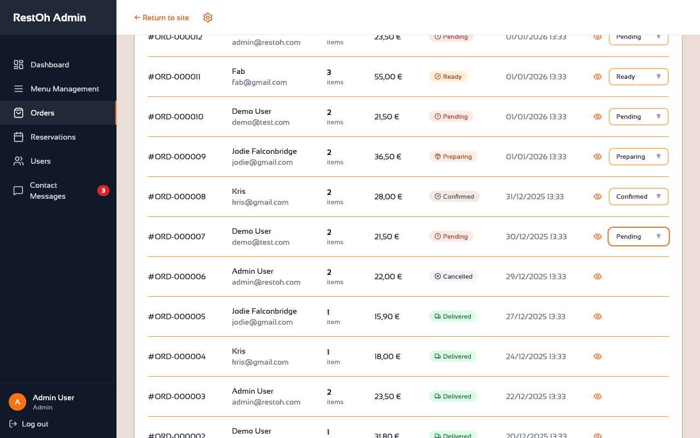

Manage all orders from this page:

**Features:**
- Filter by status (Pending, Confirmed, Preparing, etc.)
- Filter by date (Today, This week, etc.)
- Search for an order

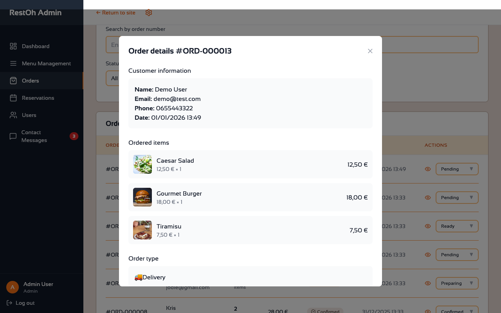

**Changing an order's status:**
1. Click on an order to open the details
2. Select the new status
3. Confirm the change

### 8.3 Reservation Management

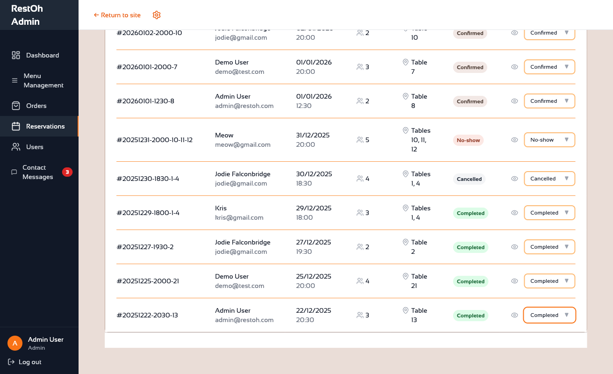

Manage all reservations:
- View today's reservations
- Confirm or cancel a reservation
- Mark as "customer arrived" or "completed"

**Reservation statuses:**
| Status | Action |
|--------|--------|
| Pending | Confirm or cancel |
| Confirmed | Mark as arrived |
| Seated | Mark as completed |
| Completed | Archived |

### 8.4 Menu Management

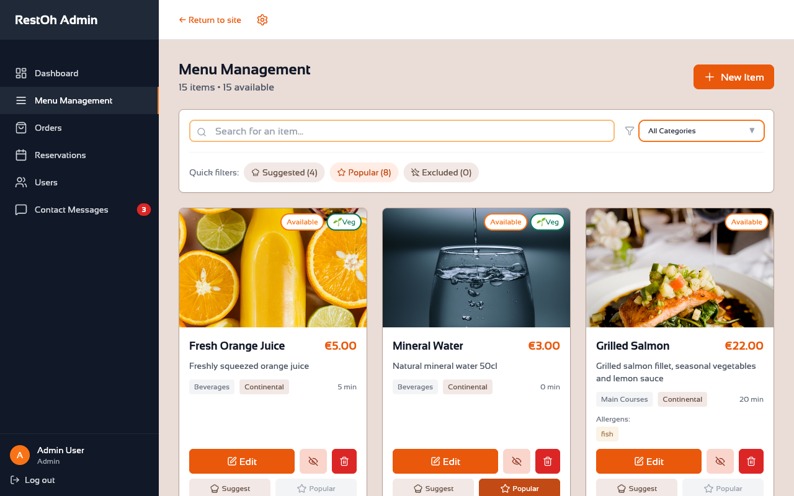

Administer the restaurant's dishes:

**Adding a dish:**

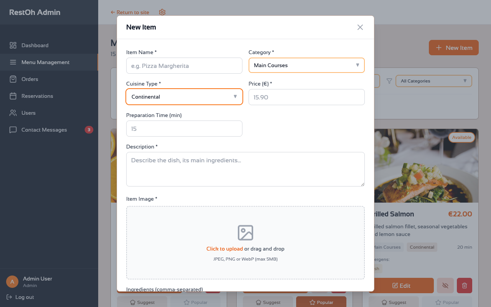

1. Click **"Add New Item"**
2. Fill in the form:
   - Name, description, price
   - Category and cuisine type
   - Preparation time
   - Allergens
   - Image URL
3. Enable/disable badges (Popular, Chef's Pick)
4. Click **"Save"**

**Editing a dish:**

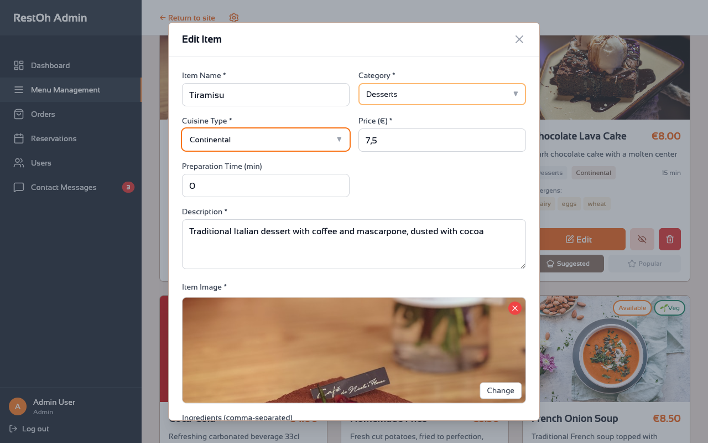

- Click the edit icon on the dish
- Modify the information
- Save

**Availability:**
- Enable/disable a dish with the toggle
- Disabled dishes don't appear in the customer menu

### 8.5 User Management

View the list of all users:
- Name, email, role
- Registration date
- Email verification status

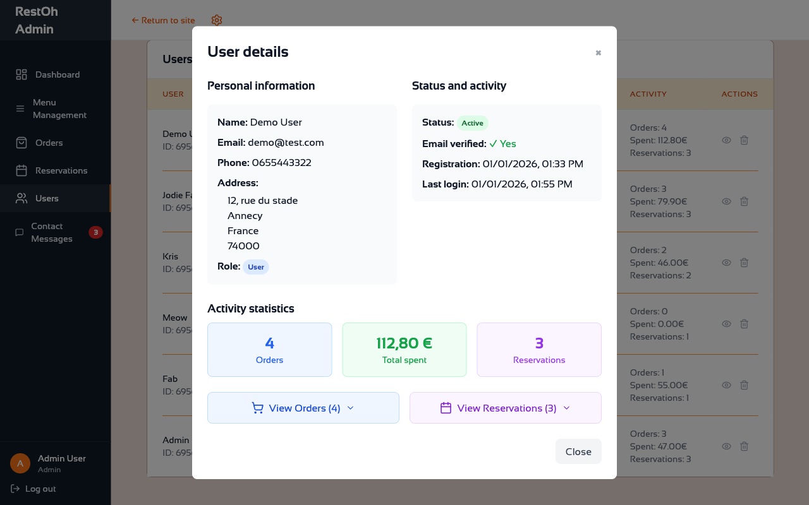

Click on a user to see:
- Their complete information
- Their order history
- Their reservations

### 8.6 Message Management

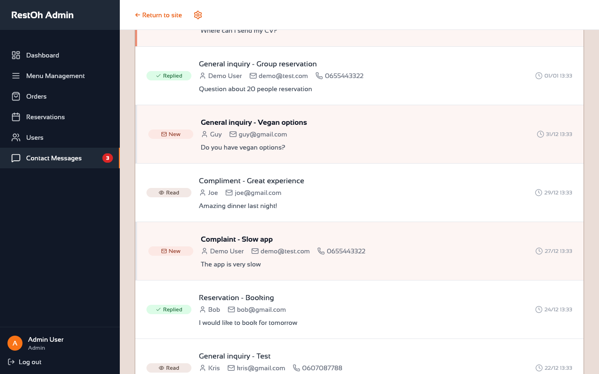

Manage messages received via the contact form:

**Message statuses:**
| Status | Description |
|--------|-------------|
| New | Unread message |
| Read | Message viewed |
| Replied | A reply has been sent |
| Closed | Conversation ended |

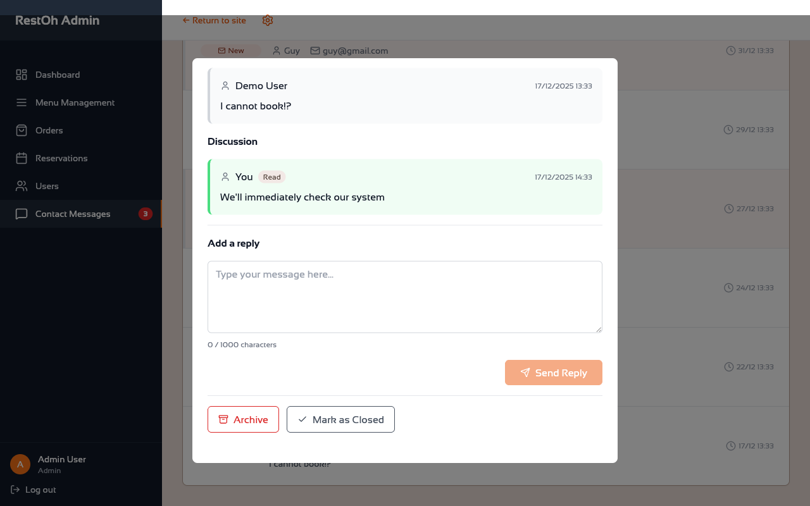

**Replying to a message:**
1. Click on the message
2. Review the conversation history
3. Type your reply
4. Click **"Send Reply"**

---

## 9. FAQ

### Frequently Asked Questions

**Q: Can I order without creating an account?**
> No, an account is required to place an order. This allows us to provide order tracking and remember your preferences.

**Q: How do I cancel an order?**
> Contact us quickly by phone. Cancellation is only possible if preparation hasn't started yet.

**Q: Is delivery free?**
> Yes, delivery is free for orders over €25.

**Q: Can I modify my reservation?**
> Yes, up to 1 hour before the scheduled time. Beyond that, contact the restaurant.

**Q: How do I know if a dish contains allergens?**
> Allergens are listed on each product card. If in doubt, please contact us.

**Q: I forgot my password, what should I do?**
> Click "Forgot password?" on the login page and follow the instructions sent by email.

### Common Problem Resolution

**The site doesn't load properly:**
- Clear your browser cache
- Try a different browser
- Check your internet connection

**I'm not receiving emails:**
- Check your spam folder
- Make sure the email address is correct
- Contact support

**My payment failed:**
- Verify your card information
- Ensure you have sufficient funds
- Try a different payment method

---

## 10. Contact & Support

### Restaurant Information

| | |
|---|---|
| **Address** | 123 Gastronomy Street, 75001 Paris, France |
| **Phone** | +33 1 23 45 67 89 |
| **Email** | contact@restoh.fr |

### Opening Hours

| Day | Lunch Service | Dinner Service |
|-----|---------------|----------------|
| Monday - Friday | 11:00 AM - 2:30 PM | 6:00 PM - 10:30 PM |
| Saturday - Sunday | 11:00 AM - 10:30 PM | |

### Contact Form

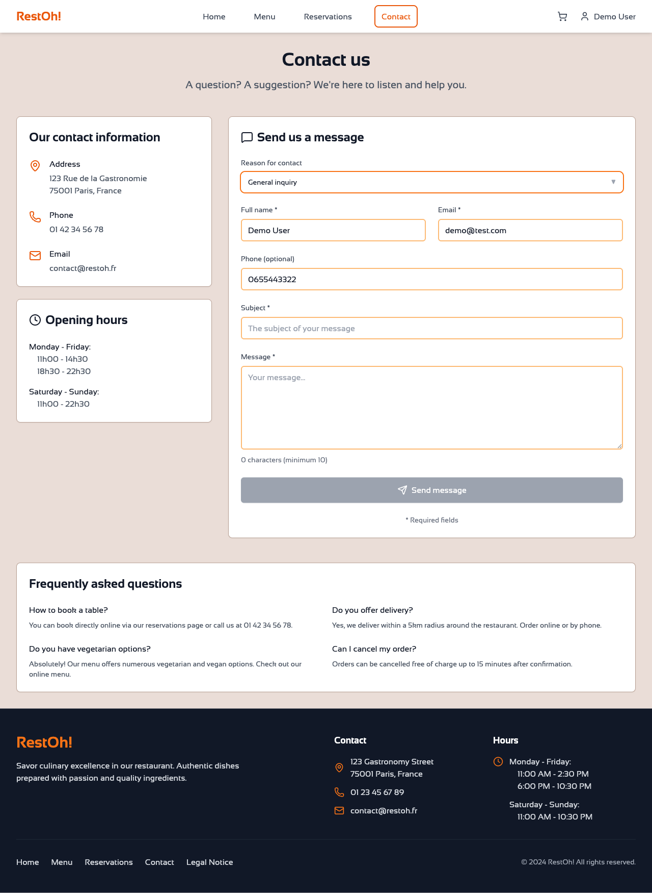

To contact us:
1. Go to the **"Contact"** page via the footer
2. Fill in the form:
   - Your name
   - Email
   - Subject
   - Message
3. Click **"Send"**

We typically respond within 24 business hours.

---

*RestOh! User Manual - Version 1.0*
*Last updated: January 2026*
